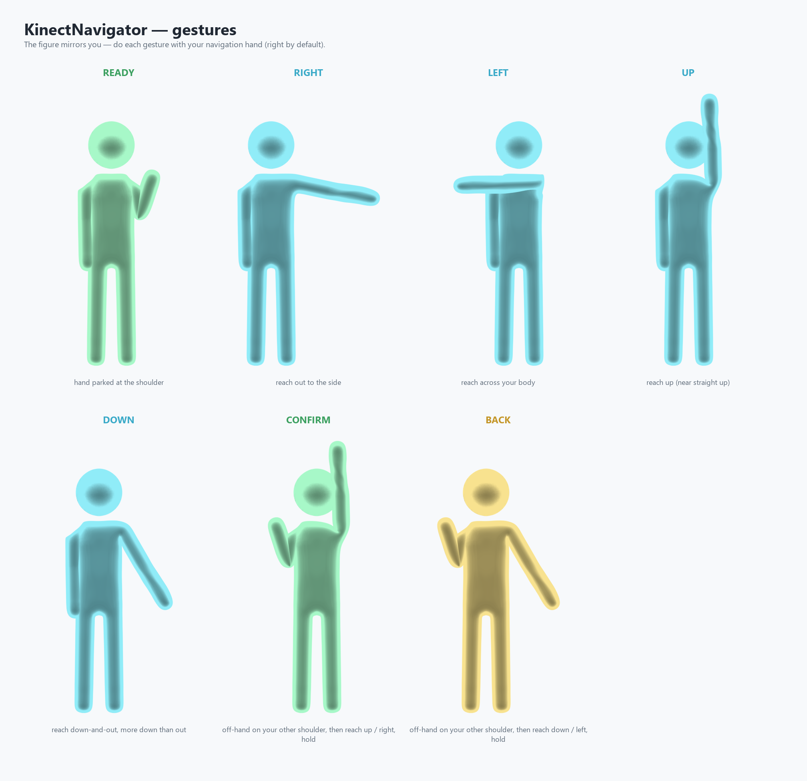

# KinectNavigator

Hands-free menu navigation for the Just Dance **Legacy Offline PC** mod, driven by Kinect v1
skeleton poses — so a dancer can browse the song list and start a routine without touching a
keyboard or phone.

**Players:** grab the latest [release](../../releases), unzip it anywhere, run
`KinectNavigator-Setup`, pick your language, install, and close. Full walkthrough in
[`SETUP.md`](SETUP.md).

> Built with AI assistance (Claude and Gemini). The code, the design decisions, and every
> in-game test are real.

## How it works

KinectNavigator is a single drop-in `Kinect10.dll` that sits **between** the game and the real
Kinect runtime. It exports the eight `Nui*` ordinals `legacy.exe` imports, forwards every call
to a renamed `Kinect10_backend.dll` (the genuine Microsoft runtime — or a webcam emulator's
fake DLL), and taps the skeleton frame on its way past. A background thread turns hand pose
into arrow / Enter / Esc keystrokes with `SendInput`, only while the game window is focused.

Only the game ever opens the sensor, so the Kinect v1 "two apps can't share one sensor"
problem never comes up.

## Navigation models

One is active at a time — pick with `nav_model` in `kinectnav.ini` (see
[`dist/kinectnav.example.ini`](dist/kinectnav.example.ini)).

### `extend` — air d-pad (default)



A virtual d-pad centred on your dominant **shoulder**. No swiping, no timing windows.

- Reach your hand out past a small **park box** into a direction **wedge** → that arrow key.
  Hold it there → auto-repeat (accelerates). Bend the elbow / return to the park box to stop.
- The gaps between wedges and straight-down are **dead**, so a hanging or dancing arm is
  ignored.
- **Clutch:** starts asleep. Park your hand at the shoulder briefly to arm it; it disarms
  itself after the arm sits idle out of play for a bit.
- **Command mode:** put your non-dominant hand on your non-dominant shoulder — now reach
  **up/right → Enter**, **down/left → Esc** (held, so it's deliberate).

### `swipe` — motion model (fallback)

Horizontal / vertical hand swipes for navigation, hand-raised-overhead for Confirm, other arm
down-and-out for Back. Runs on a 1€-filtered + Savitzky-Golay-differentiated hand signal to
kill inferred-joint jitter. Kept as a fallback; `extend` is the one that's tuned.

## On-screen HUD

A small dark overlay (top-left) shows what the recogniser sees: current state, a live d-pad,
tracking distance, and action feedback, plus one line of raw numbers for tuning. **Off by
default** — a troubleshooting aid; enable it with `overlay = 1` in `kinectnav.ini` (or the
checkbox in `KinectNavigator-Setup`).

It's a layered window, so **exclusive-fullscreen DirectX hides it** — run the game windowed or
borderless (`<Screen FullScreen="0" />` in the game's `config.xml`) to see it. Navigation works
the same either way.

## Install

Follow [`SETUP.md`](SETUP.md). Three ways, all doing the same swap:

1. **`KinectNavigator-Setup`** — a small window: pick a language, point it at the game folder,
   Install. Doubles as a live editor for `kinectnav.ini` (navigation hand, mirror, Back
   gesture, HUD, feel presets, key bindings), ships in 12 languages with a flag picker, shows
   when an update is available, and is fully portable (its own `config.txt` beside the exe).
2. **`install.bat` / `uninstall.bat`** — the same swap from a terminal.
3. **By hand** — rename the game's `Kinect10.dll` → `Kinect10_backend.dll`, drop the release's
   `Kinect10.dll` in its place, launch.

The swap: the genuine `Kinect10.dll` becomes `Kinect10_backend.dll`, the shim takes its name;
the shim forwards every call to the renamed runtime. It runs on compiled-in defaults —
`kinectnav.ini` next to it overrides thresholds with no rebuild, and is entirely optional.

Players also need the **Kinect for Windows Runtime v1.8** installed (see `SETUP.md`).

## Build from source

Visual Studio 2022 or later, **Desktop C++** workload (x86 tools), and the **Kinect for
Windows SDK 1.8** (headers only — the DLL does not link `Kinect10.lib`; the skeleton structs
are vendored in `nui_types.h`).

```
build.cmd
```

or `msbuild src\KinectNavigator.sln /p:Configuration=Release /p:Platform=Win32`. Output is
`build\Win32\Release\Kinect10.dll`, also copied to `dist\`.

A build must keep `dumpbin` clean: exactly the 8 `Nui*` ordinals (base 5), machine x86,
imports `KERNEL32 + USER32 + GDI32 + SHELL32` only, no self-import of `Kinect10.dll`.

## Antivirus

`Kinect10.dll` is unsigned and it synthesises keystrokes and hooks the game's imports — both
are textbook malware behaviours, so SmartScreen or your AV may flag it. It is a false
positive. The full source is here; build it yourself if you'd rather not trust the release
binary. See [`SETUP.md`](SETUP.md#5-troubleshooting).

## Credits

- **[itsvexor](https://github.com/itsvexor)** — *Legacy Sensor*, the webcam→Kinect emulator
  for this same mod. Confirmed the drop-in-`Kinect10.dll` approach; not affiliated.
- Skeleton structs vendored in `nui_types.h` are the public Kinect for Windows SDK 1.8
  layouts (Microsoft), used for ABI interop only.

## License

MIT — see [`LICENSE`](LICENSE). This is clean-room interop code; it contains no Ubisoft or
Microsoft source and ships no game assets.
