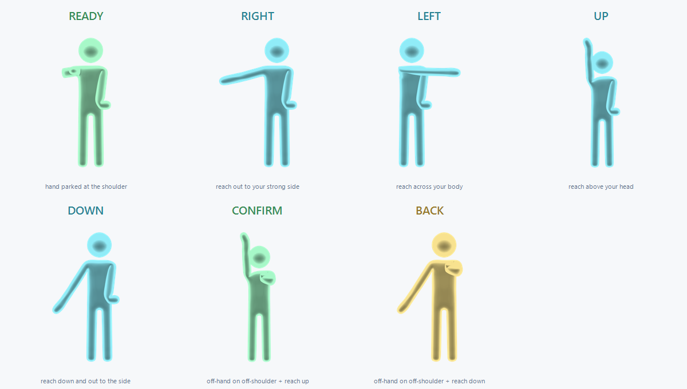

# KinectNavigator — setup guide

Hands-free menu navigation for **Just Dance Legacy Offline PC** using an Xbox 360 Kinect.
This guide is for players. It assumes you already play Legacy with a working Kinect.

---

## 1. What you need

- **Xbox 360 Kinect sensor (Kinect v1)** plus the **"Kinect for Windows" adapter** (the brick
  that gives it a USB plug and a power lead), already working with Legacy.
- The **Kinect for Windows Runtime v1.8** — you almost certainly already have this if the
  sensor works in the game. If not: `KinectRuntime-v1.8-Setup.exe` (~111 MB),
  <https://www.microsoft.com/download/details.aspx?id=40277>.
- **Room:** stand about **2.5 m** back from the sensor, centred, facing it, whole body in
  view. Kinect v1 tracks poorly closer than that.

> **Not compatible with webcam-emulator setups.** If you drive Legacy with a webcam +
> *Legacy Sensor* (itsvexor) or anything else that already replaces `Kinect10.dll` with a
> fake one, KinectNavigator can't sit on top of it — the installer needs the genuine ~15 MB
> Microsoft runtime and refuses to run otherwise. You need a real Kinect v1 sensor.

## 2. Install

**Heads-up on antivirus.** `Kinect10.dll` is not code-signed, and it works by synthesising
keystrokes and hooking the game's imports — the same things malware does. SmartScreen may say
"Windows protected your PC" (click *More info → Run anyway*) and some antivirus may quarantine
the file (restore it / add a folder exclusion). This is a false positive; the full source is
on GitHub if you'd rather build it yourself.

1. **Back up the game folder** first. `legacy.exe` is a large, unstable modded build.
2. Extract this release anywhere — keep all the files together, and *not* inside the game
   folder.
3. Double-click **`KinectNavigator-Setup`** — that's the `.vbs`; `.bat` also works, both open the
   same window. (Don't double-click `KinectNavigator-Setup.ps1` directly — Windows opens `.ps1`
   files for editing, not running.) A small window opens:
   - It tries to find your game folder; if it can't, click **Browse…** and pick the folder
     with `legacy.exe` in it.
   - The status line confirms it sees the genuine ~15 MB Kinect runtime, and notes whether the
     Kinect for Windows Runtime looks installed (best-effort check — a miss doesn't block you).
   - Optionally tick **Also enable the on-screen HUD** (writes `overlay = 1`; only shows when
     the game runs windowed — see section 4).
   - Click **Install**. A **Gestures** button in the same window has the how-to-play
     cheat-sheet if you don't want to come back to this doc.

Under the hood it copies the real `Kinect10.dll` to `Kinect10.dll.orig-backup`, renames the
real one to `Kinect10_backend.dll`, and drops KinectNavigator's `Kinect10.dll` in its place. It
won't run over an existing install or over anything that isn't the genuine runtime.

Launch the game normally. A log is written to `KinectNavigator.log` in the game folder.

### Uninstall

Open **`KinectNavigator-Setup`** again, point it at the game folder, and click **Uninstall** — it
restores the original `Kinect10.dll`. Your `kinectnav.ini`, `KinectNavigator.log`, and any
`skcap-*.skcap` are left in place.

### Updating to a new version

Extract the new release, run its `KinectNavigator-Setup`, point it at the game folder — if
KinectNavigator is already installed there the button reads **Update** instead of Install and
just swaps in the new `Kinect10.dll`. No need to uninstall first.

### Command line

Prefer a terminal? `install.bat` / `uninstall.bat` do the same thing — double-click and they
prompt for the game folder, or pass it as an argument:
`install.bat "C:\path\to\game folder"`.

## 3. Playing

Stand ~2.5 m back, centred, facing the sensor.

**Waking it up.** It starts **asleep** and ignores everything. Rest your dominant hand near
your shoulder for a moment to arm it. It disarms itself again whenever your arm just hangs or
you start dancing, so it won't fire mid-routine — re-arm the same way.

**Navigating (the air d-pad).** Picture a small `+` centred on your dominant shoulder:

| Do this | Gets you |
|---|---|
| reach your hand **out to the side** | ◀ / ▶ |
| reach **up** | ▲ |
| reach **down-and-out** to the side | ▼ |
| hold the reach | key repeats (speeds up) |
| bend your elbow / bring the hand back in | stops |

A hand hanging straight down does nothing.

**Confirm / Back.** Put your **non-dominant** hand on your **non-dominant shoulder**, then:

| Do this | Gets you |
|---|---|
| reach **up or right** and hold | Enter (start the song / confirm) |
| reach **down or left** and hold | Esc (back out) |

Take the non-dominant hand off the shoulder to go back to plain navigation.

## 4. The on-screen HUD (optional)

There's a small overlay that shows what the recogniser sees — state, a live d-pad, your
tracking distance, action feedback. It's **off by default**; it's a troubleshooting aid, not
needed for normal play.

To turn it on:

1. Run Legacy **windowed or borderless** — a layered overlay can't draw over exclusive
   fullscreen. Open `config.xml` in the game folder and set `<Screen FullScreen="0" />`.
   (Navigation works the same either way; this is only so the HUD is visible.)
2. Put `overlay = 1` in `kinectnav.ini` in the game folder (copy `kinectnav.example.ini` if
   you don't have one yet).

## 5. Troubleshooting

`KinectNavigator.log` in the game folder records what the recogniser saw — start there.

| Symptom | Fix |
|---|---|
| **Windows blocked the DLL / AV quarantined it** | False positive — see the antivirus note in section 2. Restore the file and add a folder exclusion, or build from source. |
| **Gestures do nothing** | The game window must be focused (click it). Confirm the sensor works in the game without KinectNavigator. Turn on the HUD (section 4) to see whether you're being tracked. |
| Want to see the HUD and can't | It's off by default *and* hidden by exclusive fullscreen — do both parts of section 4. |
| Tracking looks lost (HUD says **STEP BACK** / **STEP INTO VIEW**) | Move to ~2.5 m, centre yourself, face the sensor, clear the frame. |
| **Left / right reversed** | Put `mirror = 1` in `kinectnav.ini`. |
| Wrong arm drives it | Put `handedness = left` (or `right`) in `kinectnav.ini`. |
| It fires while I dance | Let your arm hang for ~1.5 s and it disarms. If it's still too eager, raise `dpad_disarm_ms`. |
| **Game crashes** | That's the game itself (it does this without KinectNavigator too). Restart it. |

## 6. Tweaking

Everything is adjustable without reinstalling: copy `kinectnav.example.ini` to `kinectnav.ini`
in the game folder and uncomment what you want to change. Every setting is explained in that
file. Changes take effect next launch.
