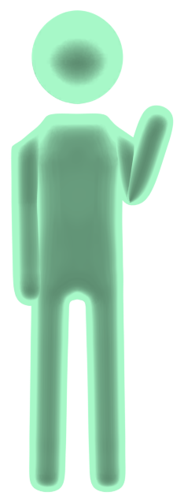
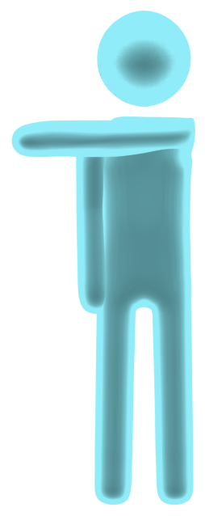
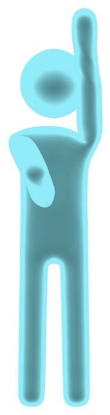
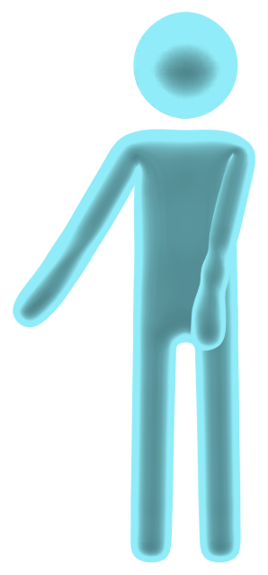
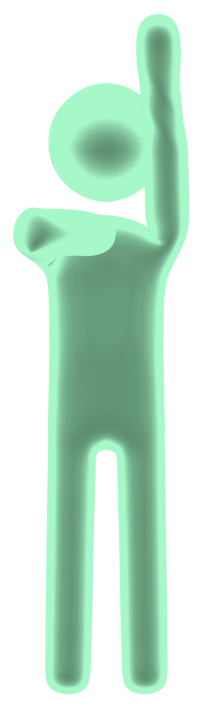
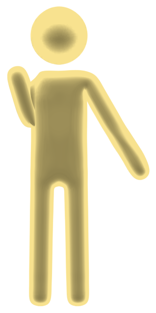

# Usage

How to actually use KinectNavigator once it's installed. For getting it installed, see
[`setup.md`](setup.md).

---

## Standing

Stand about **2.5 m** back from the sensor, roughly centred, facing it, with your whole body
in frame. Kinect v1 tracks poorly closer than ~2 m; at a real living-room distance your hands
are often *inferred* rather than tracked, so the recogniser leans on your shoulders and hips
(which track solidly) and on the **angle** and **reach** of your arm rather than an exact hand
position.

---

> The figures below mirror you, the way Just Dance's own pictograms do. Do each gesture with
> whichever hand you've set as your **navigation hand** (right by default); the other hand is
> only used for Confirm / Back.

## Waking it up (the clutch)

KinectNavigator starts **asleep** and ignores everything. To wake it, **rest your dominant
hand near your dominant shoulder** for a moment. The diagnostic HUD (if on) shows
`ASLEEP → READY`. This is also the neutral "ready" pose to come back to between moves.

It **disarms itself** two ways:

- **Lower your arm** — once your dominant hand is out of the park box, out of every direction,
  and below shoulder height for about **half a second**, it sleeps. Touching a direction or
  the park box resets that timer.
- **Start dancing** — if your whole body (not just the navigating hand) is moving a lot for
  about half a second while it's armed, it decides you've stopped navigating and sleeps. So if
  a routine starts while it's still awake, it drops out on its own. Tune with `dpad_dance_energy`
  (lower = more eager to call it "dancing") or turn it off with `dpad_dance_disarm = 0`.

You can turn the clutch off entirely (`dpad_arm = 0`, or the checkbox in **More settings…**)
so it's always live. Both of those auto-sleeps are clutch behaviour, so with it off **neither
applies** — including the dance one. Only sensible if you're navigating menus and never dancing
with it on.

---

## The air d-pad — navigation

The default model (`nav_model = extend`). Picture a small **`+`** centred on your dominant
**shoulder**, in the plane facing the sensor.

### The park box

A small dead circle around your shoulder. While your hand is inside it, nothing happens —
this is "home". Reaching your hand **out past the park box** into a direction is what triggers
a key.

Each direction is a **wedge** about **±25° wide** — Left/Right around horizontal, Up around
straight-up, Down a separate down-and-out case (below). You don't need to aim precisely, but
the gaps between the wedges are dead, so a diagonal that lands between two of them does
nothing.

### Left / Right

Reach your hand **out to the side**, arm roughly horizontal — left of your shoulder for `←`,
right for `→`. You don't need to fully extend, just clear the park box into the side wedge.

### Up

Reach **up**, within about 25° of straight up, for `↑`. Lean it much further out and it drops
into a dead gap; lean it all the way toward horizontal and it becomes a side reach instead.

### Down

Reach into a **steep diagonal down toward your hip** for `↓` — clearly below the shoulder and
angled out to the side, but **more down than out**. **Straight down is a dead zone** (an arm
hanging at your side is deliberately ignored), and so is straight out to the side — Down needs
that down-and-out angle to tell it apart from both.

### One press vs. hold-to-repeat

- Reach into a wedge and come back → **one key press**.
- Reach in and **hold** → after a short delay it **auto-repeats**, and the repeats speed up
  the longer you hold. Good for scrolling a long song list.
- **Stop** by bending your elbow / bringing your hand back toward the park box, or just
  dropping the arm.

---

## More than one player

Kinect v1 fully tracks **two** people at once (the two nearest the sensor). Either of those
two can take control: whoever **wakes up last** — brings their hand to their shoulder and
parks it — becomes the driver, and only the driver's reaches send keys. The previous driver
goes back to **ASLEEP**.

To take a turn back after you've lost control, do the wake gesture again — **hand away from
your shoulder, then back to it**. Just leaving your hand resting at your shoulder won't do it
(that stops two people from trading control back and forth). There's also a brief moment right
after a hand-off where control won't change again, so a stray movement can't bounce it.

If the person who wants to navigate is a third or fourth player the sensor isn't joint-tracking,
they should **step to the front** first — the sensor tracks the two closest bodies, so stepping
forward is what puts you in line to drive.

---

## Command mode — Confirm and Back

Navigation only sends the arrow keys. **Enter** and **Esc** need *command mode*: put your
**non-dominant** hand on your **non-dominant** shoulder and keep it there. The HUD's
command-gate bar fills as your hand nears the shoulder and latches when it's close enough.
While it's latched, the dominant-hand reaches become Enter / Esc instead of arrows. Take the
hand off the shoulder to go back to plain navigation.

### Confirm — Enter

With the gate held: reach the dominant hand **up or right** and **hold** it for about half a
second. Sends **Enter** — pick the highlighted song, start the routine, confirm a dialog.

### Back — Esc

With the gate held: reach the dominant hand **down or left** and **hold** it for about
**1.5 seconds** — longer than Confirm, because Esc is the consequential one (it opens the pause
menu / backs out). The two-hand pose plus the hold make it hard to trigger by accident.

If you never want Esc reachable, untick **Enable the Back gesture** in `KinectNavigator`
(or `enable_back = 0` in `kinectnav.ini`).

---

## The diagnostic HUD

A small dark panel, top-left, that shows exactly what the recogniser sees. It is **off by
default** — it's a troubleshooting aid, not needed for normal play.

It shows:

- a **status line** — `ASLEEP` / `READY` / `NAVIGATING` / `COMMAND`, or
  `STEP BACK` / `STEP INTO VIEW` when tracking is poor;
- a **d-pad glyph** with the park box, the wedges, and a marker for your hand
  (grey = parked, cyan = in a nav wedge, magenta = command mode);
- your **heading and distance** from the sensor;
- the **command-gate bar** (non-dominant hand → shoulder) and, mid-hold, a
  **CONFIRM / BACK dwell bar**;
- an **action flash** when a key is sent, and one line of raw numbers for tuning.

### Turning it on

1. Run Legacy **windowed or borderless** — a layered overlay can't draw over exclusive
   fullscreen DirectX. Set `<Screen FullScreen="0" />` in the game's `config.xml`.
   (Navigation itself works the same either way; this is only so the HUD is visible.)
2. Either tick **Show the on-screen HUD** in `KinectNavigator`, or put `overlay = 1` in
   `kinectnav.ini` (copy `kinectnav.example.ini` if you don't have one).

---

## Tuning it

The easiest way is **`KinectNavigator`** — the **Settings** panel and the
**More settings…** dialog write `kinectnav.ini` in the game folder as you change them. No
reinstall; changes take effect next game launch.

**Settings** (main window):

| Control | What it does |
|---|---|
| Navigation hand | which arm navigates (the other one is the command-mode hand) |
| Reverse left / right | flips left/right output if it feels mirrored |
| Enable the Back gesture | turns Esc on/off |
| Show the on-screen HUD | the diagnostic HUD (see above) |

**More settings…**:

| Control | What it does |
|---|---|
| Reach to navigate | how far past the park box you reach before a direction registers |
| Scroll speed when held | how fast auto-repeat goes |
| Command-mode reach | how close the non-dominant hand must get to the shoulder |
| Hold time for Enter / Esc | how long you hold before Confirm / Back fires |
| Require waking it up first | the clutch — off means always live |
| Key bindings | rebind any of the six output keys (press a key to capture it) |

### Editing kinectnav.ini by hand

`kinectnav.ini` sits next to `Kinect10.dll` in the game folder. Copy `kinectnav.example.ini`
(in the release's `app` folder) to `kinectnav.ini` and uncomment what you want — **every
setting is documented in that file**,
with its default and its units (distances are torso-lengths, times in milliseconds). The DLL
re-reads it on each launch and runs fine with no file at all.

---

## Alternate navigation model — swipe

`nav_model = swipe` selects an older, motion-based model instead of the air d-pad:

- **left/right and up/down hand swipes** for navigation,
- **dominant hand raised and held still, high above the shoulder**, for Confirm,
- **non-dominant arm down and out to the side (~45°), held**, for Back.

It runs on the same 1€-filtered hand signal as the d-pad, plus a Savitzky-Golay velocity
estimate for the swipe detection. The **air d-pad is the default and the tuned one**; swipe is
kept as a fallback for anyone whose tracking makes the postural d-pad awkward. Set it in
`kinectnav.ini` (`nav_model = swipe`) — there's no toggle in the setup window.
